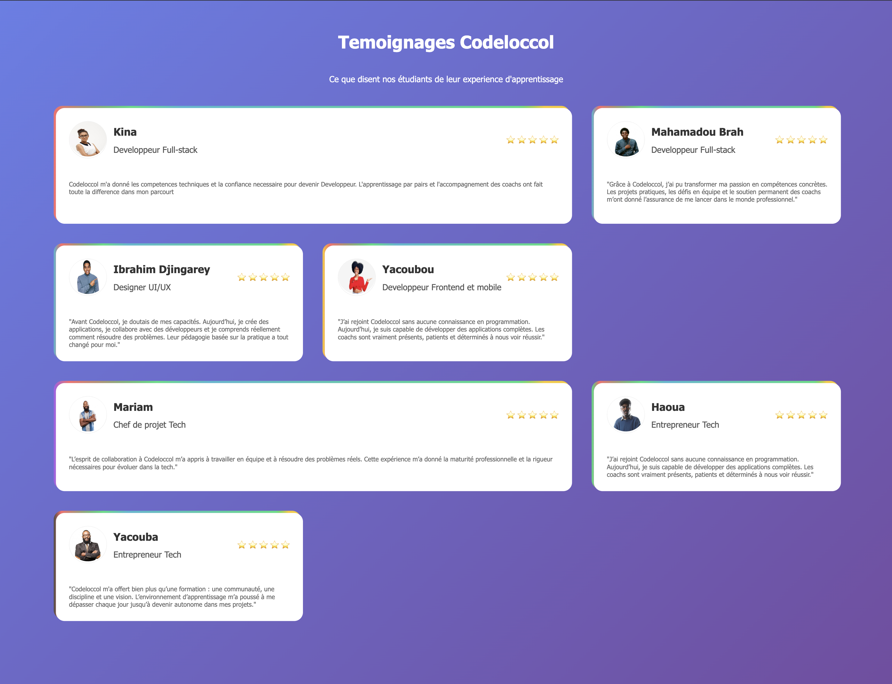

Tesimonial Page
Ce projet consiste à réaliser une page web présentant une grille de témoignages d’étudiants de Codeloccol. L’objectif est de mettre en pratique les compétences en HTML et CSS pour structurer, styliser et rendre responsive une interface utilisateur moderne.

Structurer le contenu avec des balises sémantiques.
Styliser la page pour un rendu professionnel et attractif.
Adapter la grille pour une lecture optimale sur tous les écrans.
Valoriser les retours d’expérience des apprenants.
Ce projet permet de renforcer la maîtrise des bases du développement web tout en travaillant sur un cas concret et motivant.

Objectifs

 ["Maîtriser la structure HTML & Utiliser le CSS pour la mise en page","Travailler avec des images","Créer une interface responsive ","Comprendre l’importance des témoignages & Développer l’attention aux détails "]

 